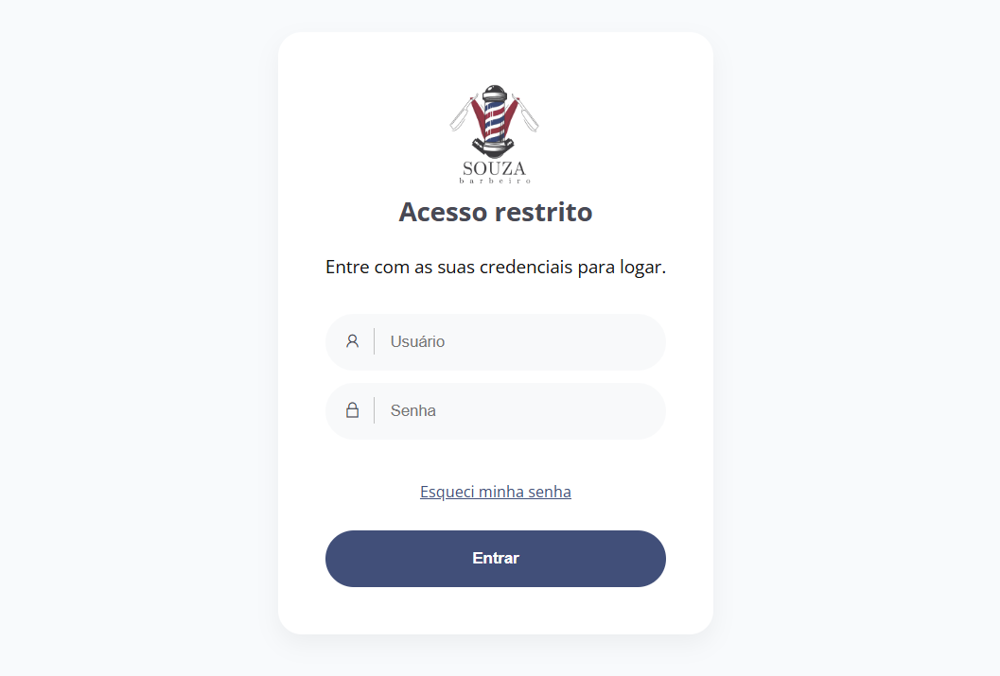

# 💈 Painel de Gestão - Barbearia



> Sistema web desenvolvido em **React.js** para o gerenciamento de clientes e planos mensais de uma barbearia.  
> O projeto está **em fase de desenvolvimento**, com o objetivo de fornecer ao dono da barbearia um painel administrativo completo e intuitivo.

---

## 🚀 Tecnologias Utilizadas

- **React.js** — Biblioteca principal para criação da interface.
- **React Router DOM** — Navegação entre as páginas.
- **Context API** — Gerenciamento global de autenticação.
- **Framer Motion** — Animações de transição entre páginas e modais.
- **Chart.js** — Exibição de gráficos e dashboards.
- **CSS Modules** — Estilização com escopo local e classes independentes.
- **Node.js + Express (API separada)** — Backend responsável pela autenticação e gerenciamento de dados.

---

## 🧩 Pré-requisitos

Antes de iniciar, certifique-se de ter instalado:
- **Node.js** (versão 18 ou superior)
- **npm** ou **yarn**
- O **backend** rodando localmente (`http://localhost:5000`)

---

## 🛠️ Como Iniciar o Projeto

### 1️⃣ Clone o repositório
```bash
git clone https://github.com/Vitorbbs99/barbearia-frontend.git
```

### 2️⃣ Acesse a pasta do projeto
```bash
cd nome-do-repositorio
```

### 3️⃣ Instale as dependências
```bash
npm install
```

### 4️⃣ Inicie o servidor de desenvolvimento
```bash
npm start
```

O projeto será executado em:  
👉 [http://localhost:3000](http://localhost:3000)

---

## 🚧 Status do Projeto

🟡 **Em desenvolvimento ativo**

Próximas etapas:
- Integração completa dos gráficos do dashboard.
- Melhorias visuais e responsividade.
- Sistema de permissões por usuário.
- Deploy no Vercel (frontend) e Render (backend).